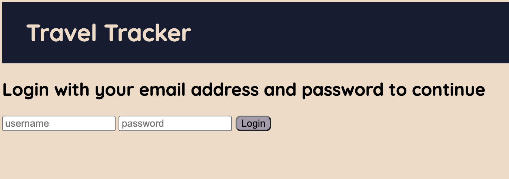

## About The Project

This project is part of Turing Software and Designs' Front-End Program, Module 2. This project focuses on creating a travel application that can track a user's past, pending, and upcoming trips. The program is implemented with ES6 syntax and exclusively uses array-prototype methods whenever iterations are needed. Fetch APIs was used to generate data for the travelers, destinations, and trips. The user can also request a trip, requiring a Fetch POST Api. The task was to create several objects containing methods which would dynamically display a given user's data on the DOM. 

### Built With

* Node.js
* Mocha
* Chai
* Fetch API
* Webpack

### Installation
In your terminal:
1. Clone the repo- `git@github.com:ericberglund117/Travel-Tracker.git`

2. Install NPM packages- `npm install`

## Usage
#### LOGIN PAGE VIEW

## TRAVELER PAGE VIEW

## TRAVELER TRIP REQUEST PAGE VIEW

## DESTINATIONS VIEW

## Roadmap

The total time allotted for this project was approximately 6 days. Future features contemplated by the developers include the following:

* Updating the css styles to be more user friendly
* Adding an travel agent class to see all the travelers, determine the status of their trips, generate a 10% cut of the user trip cost, and recommend suggested activities for a specific traveler based on their destination of choice.

## Contact

[Eric Berglund](https://github.com/ericberglund117)

## Acknowledgements

Robert Gu - This developer team would like to thank Turing Module 2 anchor instructor Robert Gu for his assistance throughout this project and for his daily lessons on the magic of Javascript.

Travis Rollins - We would also like to thank Turing Module 2 instructor Travis Rollins for his guidance and assistance on this project and the module in general

Our Turing Mentors - Including Turing-wide mentor John Adams and Eric Fitzsimons for their constant support throughout this challenging project.
